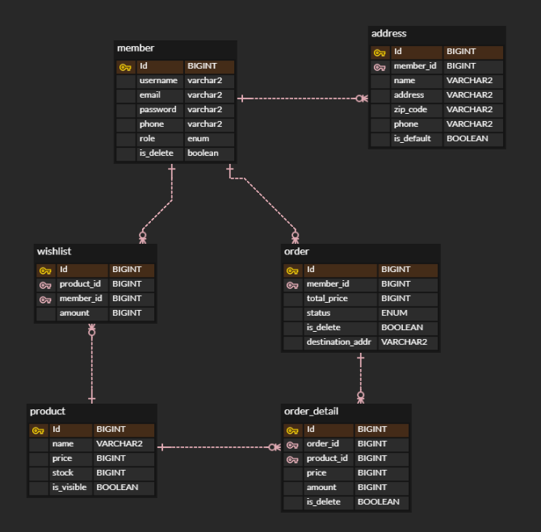

# MSA, EDA 기반의 선착순 할인판매 시스템

## 목차

- [개요](#개요)
- [기술스택](#기술-스택)
- [ERD](#ERD)
- [아키텍처](#아키텍처)
- [주요 기술](#주요-기술)
- [트러블슈팅 및 성능 개선](#트러블슈팅-및-성능-개선-과정)
- [성능개선 결과 요약 그래프](#주문-API-성능개선-결과-요약)

## 개요

이 프로젝트는 MSA와 EDA를 적용하여 주문, 결제 시스템의 동시성 문제와 트래픽 처리에 중점을 둔 애플리케이션입니다.

주요 목표는 동시성 제어와 고성능 트래픽 처리로, 대규모 요청이 동시에 들어왔을 때 데이터 정합성을 유지하며 성능 저하 없이 처리가 가능하도록 설계되었습니다. 이를 위해 Redis 분산 락, Kafka 를 통한
비동기적인 이벤트 처리를 활용하여 효율적인 확장성과 데이터 일관성을 보장하였습니다.

작업 기간 : 24/08/07 ~ 24/09/04 ( 총 4주 )

### API 문서

- [바로가기 (PostMan)](https://documenter.getpostman.com/view/27127895/2sA3s7k9b8)
- [바로가기 (Notion)](https://ossified-order-470.notion.site/API-b1d2dc7a6fff404098dda1db0b81029d?pvs=4)

---

## 기술 스택

|                   | Tech                 | Usage                           |
|-------------------|----------------------|---------------------------------|
| Language          | Java 17              |                                 |
| Framework         | SpringBoot 3.3.2     | Web Application Server          |
| Build             | Gradle               | Build tool                      |
| Database          | MySQL                | RDBMS                           |
| ORM               | Spring Data JPA      |                                 |
| Cloud             | Spring Cloud         | 마이크로서비스 지원을 위한 공통 의존성 관리와 버전 관리 |
| Service Discovery | Spring Eureka        | 서비스 간 통신이 용이하도록 서비스 등록 및 발견을 지원 |
| API Gateway       | Spring Cloud Gateway | 클라이언트와 서비스 간의 단일 진입점            |
| Metric            | Spring Actuator      | 애플리케이션 지표 수집                    |
| Library           | Feign Client         | 모듈 간 통신을 위해 사용                  |
| Library           | Redisson             | 주문 생성 서비스에서 분산락 사용              |
| Library           | Jmeter               | 성능 및 부하 테스트 툴                   |
| Messaging         | Kafka                | 비동기 메시징 및 이벤트 스트리밍 관리           |
| Monitoring        | Prometheus, Grafana  | 애플리케이션 지표 시각화 및 모니터링            |
| Monitoring        | InfluxDB             | 시계열 데이터 저장 및 JMeter 테스트 결과 시각화  |
| DevOps            | Docker               | WAS 및 마이크로서비스에 필요한 의존성 컨테이너 구동  |
| VCS               | Git                  | 버전 관리                           |

---

## ERD

<strong> 이미지 보기 </strong>

---

## 아키텍처

- `마이크로서비스 아키텍처`
    - 각 서비스들의 독립성과 확장성을 고려하여 MSA를 도입했습니다.
    - 각 서비스가 각자의 비즈니스 로직에 집중할 수 있도록 하여 서비스 간 의존성을 최소화했습니다.
- `이벤트 기반 아키텍처`
    - Kafka를 사용해 이벤트 기반의 통신을 도입하여 주문, 재고 관리등의 실시간 이벤트를 처리하여 서버의 응답성을 높일 수 있었습니다.
    - 각 마이크로 서비스가 좀 더 느슨한 결합을 가지고, 내부적으로 강한 응집도를 갖게 할 수 있었습니다.

<strong> 이미지 보기 </strong>

---

## 주요 기술

- `API Gateway`
    - 단일 진입점을 구성하고, 모든 요청에 대한 라우팅과 토큰 검사를 수행합니다.
- `사용자 토큰 관리`
    - 다중 기기 접근 지원
        - 구독 기반이 아닌 서비스의 특성 상, 여러 기기에서 동시에 접속하여 주문할 수 있도록 설정해두는것이 비즈니스적으로 유리하다고 판단하였습니다.
    - 성능 최적화
        - Redis를 사용하여 토큰 검증 및 갱신과 같은 작업에서 저렴한 비용과 높은 응답 속도를 보장하였습니다.
    - 토큰 유효성 관리
        - Token Version을 Claims 에 저장하여, 발급된 모든 토큰을 일괄적으로 유효하지 않게 만드는 기능을 구현하였습니다.
- `Feign Client`
    - 마이크로 서비스 간 통신을 위하여 Feign Client를 도입하였습니다.
    - 서킷브레이커, retry 등의 설정을 통하여 회복 탄력성 강화하려 노력했습니다.
- `Redission`
    - 분산 환경에서 데이터 일관성을 보장하고, 트래픽이 몰리는 상황에서의 동시성 문제를 해결하기 위해 RedLock 알고리즘을 사용했습니다.
    - 현재는 단일 Redis 인스턴스 환경이지만, 향후 클러스터를 구성하게 되어도 일관된 락을 제공할 수 있고, Redis 서버의 부하를 줄이기 위해 비동기적인 락 획득 매커니즘을 사용했습니다.
- `Saga`
    - 각 마이크로 서비스 간의 분산 트랜잭션 관리를 위하여 Saga 패턴을 적용하였습니다.
    - 프로젝트의 볼륨을 고려하여 중앙 오케스트레이터 없이 각 서비스가 자체적으로 이벤트를 처리하는 코레오그래피 방식을 선택하였습니다.
- `Apache Kafka`
    - Kafka는 분산 시스템에서 데이터 처리, 메시지 저장, 복구에 중점을 둔 반면 RabbitMQ는 실시간 메시지 브로커 역할에 더 초점을 맞추고 있습니다. 본 프로젝트에서는 **데이터 정합성과 일관성이
      가장
      중요한 요소**였기 때문에 Kafka를 선택했습니다.
    - 대규모 데이터 처리에 특화되어, MSA 환경에서 **서비스가 증가하고 트래픽이 증가하더라도** 안정적으로 동작하고, Redis Pub/Sub 이나 RabbitMQ 보다 더 높은 처리량을 제공합니다.

## 트러블슈팅 및 성능 개선 과정

### Issue #1

**재고 동시성 문제**

- 원인
    - 10,000 명의 사용자가 동시에 한 API에 접근했을 때, 각 쓰레드는 자신이 최초로 조회한 시점의 데이터를 기반으로 처리하기 때문에 발생함
- 해결 과정
    - **synchronized 를 이용한 비관적 락 사용**
        - 동시성 문제는 해결할 수 있었지만, 락이 걸린 동안 다른 쓰레드가 대기해야 했기 때문에 성능 저하 발생
        - avg : 2882ms / tps : 68.43

<strong> 결과 이미지 보기 </strong>

---

### Issue #2

**Synchronized로 인한 성능 저하**

- 원인
    - 비관적 락을 사용하여 동시성 문제를 해결하려다 보니, API 전체에 락을 걸어 싱글 쓰레드 방식으로 동작하게 되어 병렬 처리가 불가능해 성능 저하가 발생함

- 해결 과정

1. **synchronized + redis 캐싱**
    - 상품의 재고 조회 결과를 redis 에 캐싱해두어 DB에 접근하는 횟수를 줄여 조회 성능 최적화
    - 생성할 주문의 데이터를 ConcurrentHashMap 에 캐싱해두고 추후 저장하도록 하여 성능 최적화 시도
    - 하지만 결국 재고를 수정하는 작업은 병렬 처리가 불가능했기 때문에, 전체적인 성능 향상은 크지 않았음.
    - avg : 2061ms / tps : 94.83

<strong> 결과 이미지 보기 </strong>

2. **레디스 분산 락을 통한 동시성 제어, Kafka 를 통한 이벤트 기반 관리**

- Redis의 분산 락을 통하여 동시성 문제를 해결
- 이벤트 기반 통신으로 느슨한 결합을 유지하면서 빠른 응답을 제공

2-1. **모든 로직을 이벤트로 처리**

- 결국 DB에 접근하게 되면 빠른 응답은 불가능할것이라 판단하여, 주문이 들어오면 이벤트를 발생시키고, 이벤트를 구독한 마이크로 서비스들이 각자의 로직을 통하여 DB에 접근하도록 설정
- avg : 247.41ms / tps : 917.95
- [컨텍스트 스위칭 이슈 해결과정](#issue-3)

<strong> 결과 이미지 보기 </strong>

- 총 5만건의 요청, 선착순 500명만 구매 가능
    - 결제 실패 확률 20% 로 진행
    - 주문 성공 500건, 결제 실패 126건 모두 데이터베이스에 저장

2-2. **Order 정보 저장 후 나머지 로직은 이벤트로 처리 (최종 선택)**

- 결제 완료 후 주문 데이터가 DB에 안전하게 저장되기 전에 시스템 장애가 발생할 경우 데이터가 유실될 수 있음.
- 주문 처리가 가장 중요한 비즈니스 로직이며, 데이터의 일관성과 안정성이 우선인 현재 프로그램에서 데이터 유실의 위험은 감수할 수 없다고 판단
- 성능이 약간 저하되더라도 **안정성을 보장**하기 위하여 주문 즉시 DB에 저장하도록 변경
- avg : 387.72ms / tps : 466.78

<strong> 결과 이미지 보기 </strong>

- 총 1만건의 요청
    - 사용자 변심 확률 20%, 결제 실패 확률 20% 로 진행
    - 주문 성공 6385건, 결제 실패 1620건 모두 데이터베이스에 저장
    - 사용자의 변심으로 인한 결제 미실행건은 데이터베이스에 저장하지 않음

---

### Issue #3

**컨텍스트 스위칭으로 인한 성능 저하**

- 원인
    - 멀티스레드 환경에서 CPU가 하나의 스레드에서 다른 스레드로 작업을 전환할 때 오버헤드 발생

- 해결 과정

1. **DB Active Connection 갯수 설정**
    - HikariCP의 Active Connection 갯수가 4에서 더이상 올라가지 않는것을 발견
    - 동시에 많은 트래픽이 몰렸을 때, 효율적인 처리를 위해 커넥션 풀의 크기를 HikariCP에서 권장하는 DB 커넥션 수 공식에 따라 커넥션 풀 크기를 9로 설정
    - 설정 후에도 마찬가지로 active connection 최댓값이 4개임을 확인

2. **CPU 코어 수와의 연관관계 확인**
    - 10코어에서도 동일한 문제가 발생하여 CPU 코어 수와 직접적인 관련이 없음을 확인

3. **커넥션 풀 크기 조정**
    - 커넥션 풀의 크기를 줄이거나 늘려도 성능 차이가 없음을 확인
    - 스레드 수 또는 다른 요소가 병목 지점이라 판단

4. **사용중인 스레드 수 확인**
    - 기본 Executor 인 SimpleAsyncTaskExecutor 로 인해, 동시 요청 수 만큼 스레드가 생성되는것을 확인
    - 하이퍼스레딩이 가능한 cpu 를 사용중이고, 주 작업이 I/O 바운드이기 때문에
    - corePoolSize 를 8로, maxPoolSize 를 16 으로 설정하여 불필요한 스레드 생성을 방지한 customExecutor 생성

5. **API 전체를 비동기 병렬 작업으로 변경**
    - 주문 생성 시 사용할 executor 를 명시적으로 지정해준 후 실행
    - 기존 로직 5만건 평균 응답 속도 : 254ms , tps : 917
    - 신규 로직 5만건 평균 응답 속도 : 61.15ms , tps : 3.04k

<strong> 결과 이미지 보기 </strong>

- 총 5만건의 요청, 모두 구매가능
    - 결제 실패 확률 0% 로 진행

---

### 주문 API 성능개선 결과 요약

<strong> 케이스 별 테스트 결과 이미지 </strong>

### [case 1](#issue-1)

### [case 2](#issue-2)

### [case 3](#event-driven-process)

### [case 4](#issue-3)

### [case 5](#stable-event-driven-process)

