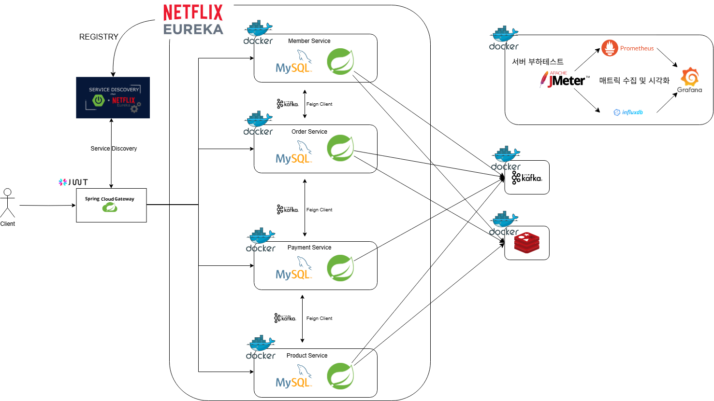
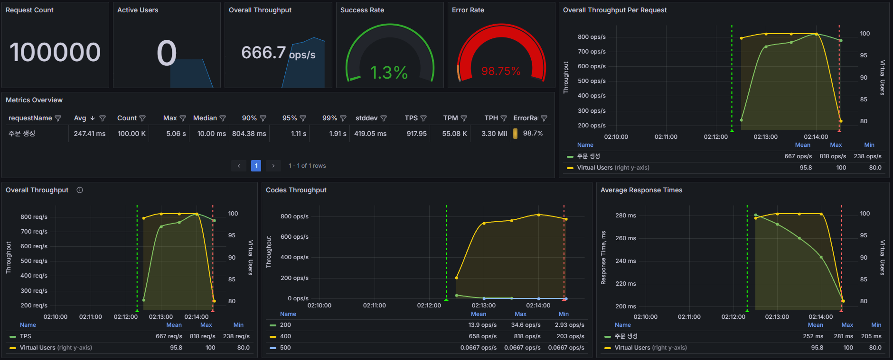

# MSA, EDA 기반의 선착순 할인판매 시스템

## 목차

- [개요](#개요)
- [기술스택](#기술-스택)
- [기술적 의사결정](#기술적-의사결정)
- [ERD](#ERD)
- [아키텍처](#아키텍처)
- [주요 기능](#주요-기능)
- [트러블슈팅](#트러블슈팅)
    - [재고 동시성 문제](#issue-1)
    - [동시성 제어로 인한 성능 저하](#issue-2)
        - [Synchronized + 캐싱](#synchronized+caching)
        - [레디스 분산 락을 통한 동시성 제어, Kafka 를 통한 이벤트 기반 관리](#redis+kafka)
            - [모든 로직을 이벤트로 처리](#event-driven-process)
            - [Order 정보 저장 후 나머지 로직은 이벤트로 처리 (최종 선택)](#stable-event-driven-process)
    - [컨텍스트 스위칭으로 인한 성능 저하](#issue-3)
- [성능개선 결과 요약 그래프](#주문-API-성능개선-결과-요약)

 

## 개요

MSA와 EDA를 적용하여 주문, 결제 시스템의 동시성 문제와 트래픽 처리에 중점을 둔 애플리케이션  

**목표**

- 대규모 요청이 동시에 들어왔을 때 데이터 정합성을 유지하며 성능 저하 없이 처리
- Redis 분산 락, Kafka 를 통한 비동기적인 이벤트 처리를 활용하여 확장성과 데이터 일관성을 보장

작업 기간 : 24/08/07 ~ 24/09/04 ( 총 4주 )

### API 문서

- [바로가기 (PostMan)](https://documenter.getpostman.com/view/27127895/2sA3s7k9b8)
- [바로가기 (Notion)](https://ossified-order-470.notion.site/API-b1d2dc7a6fff404098dda1db0b81029d?pvs=4)

 

## 기술 스택

**Language** &nbsp; : &nbsp;

**Framework** &nbsp; : &nbsp;

**Libraries** &nbsp; : &nbsp;

**Database** &nbsp; : &nbsp;

**Messaging** &nbsp; : &nbsp;

**Monitoring** &nbsp; : &nbsp;

**Build Tool** &nbsp; : &nbsp;

**Testing Tools** &nbsp; : &nbsp;

**DevOps** &nbsp; : &nbsp;

 

## 기술적 의사결정

<strong> 내용 보기 </strong>

- `Java 17`
    - record 클래스와 switch문, 텍스트 블록 등의 기능이 코드 가독성을 향상
    - Java 21의 버추얼 스레드는 실질적인 성능 개선이 없었음

- `Feign Client`
    - 마이크로 서비스 간의 통신을 위해 사용
    - 어노테이션 기반으로 기존 코드와의 일관성을 유지
    - Netflix OSS 모듈과의 호환성으로 서킷 브레이커, retry, fallback 등을 간편하게 설정할 수 있음

- `Redis`
    - 서버의 응답성을 높이기 위한 인메모리 데이터베이스
    - `Redisson`
        - Redis 클러스터로 확장되더라도 일관적인 락 알고리즘 제공
        - 분산 환경에서 데이터 일관성을 보장
        - 트래픽이 몰리는 상황에서의 동시성 문제 해결 가능
        - SpinLock 의 서버 부담을 줄이기 위해 RedLock을 사용
- `JWT`
    - 다중 기기 접근 지원
        - 구독 기반이 아닌 서비스의 특성 상, 여러 기기에서 동시에 접속하여 주문할 수 있도록 설정해두는것이 비즈니스적으로 유리하다고 판단
    - 성능 최적화
        - Redis를 사용하여 토큰 검증 및 갱신과 같은 작업에서 저렴한 비용과 높은 응답 속도를 보장
    - 토큰 유효성 관리
        - Token Version을 Claims 에 저장하여, 발급된 모든 토큰을 일괄적으로 유효하지 않게 만드는 기능 구현

- `Kafka`
    - Kafka : 분산 시스템에서 데이터 처리, 메시지 저장, 복구에 초점
    - RabbitMQ : 실시간 메시지 브로커 역할에 초점
    - 주문-결제 시스템에서는 **데이터 정합성과 일관성이 가장 중요한 요소**라 판단
    - MSA 환경에서 **서비스가 증가하고 트래픽이 증가하더라도** 안정적으로 동작함
    - 분산 환경에서 Redis Pub/Sub 이나 RabbitMQ 보다 더 높은 처리량을 제공

- `Saga`
    - 각 마이크로 서비스 간의 분산 트랜잭션 관리를 위하여 Saga 패턴 적용
    - 프로젝트의 볼륨을 고려하여 중앙 오케스트레이터 없이 각 서비스가 자체적으로 이벤트를 처리하는 코레오그래피 방식 채택

- `마이크로서비스 아키텍처`
    - 각 서비스들의 독립성과 확장성을 고려하여 MSA를 도입
    - 각 서비스가 각자의 비즈니스 로직에 집중할 수 있도록 하여 서비스 간 의존성을 최소화

- `이벤트 기반 아키텍처`
    - 비동기 처리와 확장성이 중요한 로직은 이벤트 기반의 통신을 도입
    - 주문, 재고 관리등의 실시간 이벤트를 처리하여 서버의 응답성을 높일 수 있었음
    - 각 마이크로 서비스가 좀 더 **느슨한 결합**을 가지고, 내부적으로 **강한 응집도**를 가짐

 

## ERD

<strong> 이미지 보기 </strong>

 

## 아키텍처

<strong> 이미지 보기 </strong>

 

## 주요 기능

<strong> 내용 보기 </strong>

- `API Gateway`
    - 단일 진입점을 구성하고, 모든 요청에 대한 라우팅과 JWT의 유효성 검사 담당
- `Eureka Server`
    - 중앙에서 서비스들의 상태를 관리할 수 있고, 서비스 간 통신이 용이하도록 서비스 등록 및 발견을 담당
- `Member Service`
    - 회원가입, 로그인, 주문내역 조회 등 사용자 관련 기능을 담당
    - Feign Client를 활용, 타 서비스와 Non Blocking 방식으로 통신하여 성능 최적화
- `Order Service`
    - 구매 요청-취소, 선착순 구매 등의 주문 관련 기능을 담당
    - 일반 주문과 선착순 주문을 구분하여 처리
    - 일반 주문은 Feign Client 를 활용하여 동기적으로 처리
    - 트래픽이 몰리는 선착순 주문은 이벤트를 활용하여 비동기적으로 처리
- `Product Service`
    - 상품 관리, 재고 관리 등 상품 관련 기능을 담당
    - 할인 판매 상품은 Redis 에 캐싱하여 조회 성능 최적화 및 동시성 제어
    - Kafka 이벤트를 수신하여 재고를 수정
- `Payment Service`
    - Kafka 이벤트를 수신하여 내부 로직을 실행하고, 결과 이벤트를 발행

 

## 트러블슈팅

### Issue #1

**재고 동시성 문제**

- 원인
    - 다수의 스레드가 동시에 한 공유 자원에 접근하게 될 때, 각각의 스레드가 가지고 있는 정보가 서로 같거나 다름
- 해결 과정
    - **synchronized 를 이용한 API 락 사용**
        - 동시성 문제는 해결할 수 있었음
        - 락이 걸린 동안 다른 쓰레드가 대기해야 했기 때문에 성능 저하 발생
        - avg : 2882ms / tps : 68.43

<strong> 결과 이미지 보기 </strong>

 

---

 

### Issue #2

**Synchronized로 인한 성능 저하**

- 원인
    - Synchronized 로 인하여 병렬 처리가 불가능해 성능 저하

- 해결 과정

### 1. Synchronized + 캐싱

- 상품 재고를 redis 에 캐싱해 조회 성능 최적화
- 주문 데이터를 ConcurrentHashMap 에 캐싱해두고 추후 저장하도록 하여 성능 최적화 시도
- 재고 수정 작업은 병렬 처리가 불가능
- **전체적인 성능 향상은 크지 않았음**
- avg : 2061ms / tps : 94.83

<strong> 결과 이미지 보기 </strong>

 

### 2. 레디스 분산 락을 통한 동시성 제어, Kafka 를 통한 이벤트 기반 관리

- Redis의 분산 락을 통하여 동시성 문제를 해결
- 이벤트 기반 통신으로 느슨한 결합을 유지하면서 빠른 응답을 제공

 

#### 2-1. 모든 로직을 이벤트로 처리

- DB에 접근하게 되면 빠른 응답은 불가능할것이라 판단
- 주문이 들어오면 이벤트를 발생 -> 이벤트를 구독한 마이크로 서비스들이 각자의 로직을 실행하도록 수정
- avg : 247.41ms / tps : 917.95
- [컨텍스트 스위칭 이슈 해결과정](#issue-3)

<strong> 결과 이미지 보기 </strong>

- 총 5만건의 요청, 선착순 500명만 구매 가능
    - 결제 실패 확률 20% 로 진행
    - 주문 성공 500건, 결제 실패 126건 모두 데이터베이스에 저장

 

#### 2-2. Order 정보 저장 후 나머지 로직은 이벤트로 처리 (최종 선택)

- 캐시를 사용하는 경우, 캐시에 저장된 데이터가 유실될 수 있음
- 주문 처리가 가장 중요한 비즈니스 로직이며, 데이터의 일관성과 안정성이 우선인 현재 서비스에서 데이터 유실의 위험은 감수할 수 없다고 판단
- 성능이 저하되더라도 **안정성을 보장**하기 위하여 주문 즉시 DB에 저장하도록 변경
- avg : 387.72ms / tps : 466.78

<strong> 결과 이미지 보기 </strong>

- 총 1만건의 요청
    - 사용자 변심 확률 20%, 결제 실패 확률 20% 로 진행
    - 주문 성공 6385건, 결제 실패 1620건 모두 데이터베이스에 저장
    - 사용자의 변심으로 인한 결제 미실행건은 데이터베이스에 저장하지 않음

 

---

 

### Issue #3

**컨텍스트 스위칭으로 인한 성능 저하**

- 원인
    - 멀티스레드 환경에서 CPU가 하나의 스레드에서 다른 스레드로 작업을 전환할 때 오버헤드 발생

- 해결 과정

1. **HikariCP Active Connection 설정**
    - DB Connection 갯수가 4에서 더이상 올라가지 않는 문제 인지
    - CPU 코어 수와도 관계가 없고, 커넥션 풀 크기를 조정해도 아무런 변화가 없음
    - 스레드 수 또는 다른 요소가 병목 지점이라 판단

2. **스레드 설정 확인 및 수정**
    - 기본 Executor가 동시 요청 수만큼 스레드를 생성해 불필요한 오버헤드 발생
    - 불필요한 스레드 생성을 방지하기 위해 corePoolSize 8, maxPoolSize 16으로 설정한 customExecutor 를 명시적으로 지정해 사용

3. **API 전체를 비동기 병렬 작업으로 변경**
    - 주문 생성 API 전체를 비동기적으로 처리
    - 기존 로직 5만건 평균 응답 속도 : 254ms , tps : 917
    - 신규 로직 5만건 평균 응답 속도 : 61.15ms , tps : 3.04k

<strong> 결과 이미지 보기 </strong>

- 총 5만건의 요청, 모두 구매가능
    - 결제 실패 확률 0% 로 진행

---

### 주문 API 성능개선 결과 요약

<strong> 케이스 별 테스트 결과 이미지 </strong>

### [case 1 (Synchronized)](#issue-1)

### [case 2 (Synchronized + Caching)](#synchronized+caching)

### [case 3 (Redis Lock + Kafka)](#event-driven-process)

### [case 4 (Redis Lock + Kafka + Context Switching)](#issue-3)

### [case 5 (Redis Lock + Kafka + Stable Blocking)](#stable-event-driven-process)

